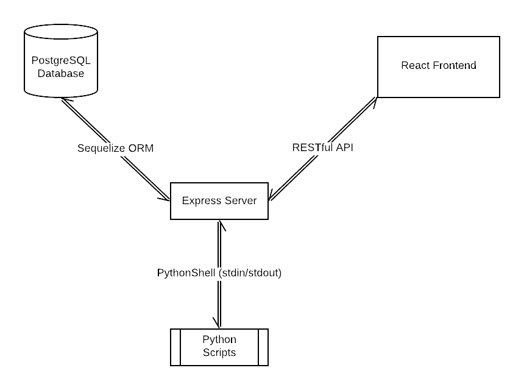

# Application Architecture 🔮

## Index

1. [README](../README.md)
2. [Usage](usage.md)
3. [Kinetic Laws](kinetic-laws.md)
4. [References](references.md)

## Repository Structure 📚

Please use the following repository structure as reference to understand the application architecture more well.

```
 |- client              -> Contains the code of the react client
    |- build            -> Build of the react client
    |- src              -> Source files of the react client
        |- components   -> React components
        |- store        -> Global store
        |- assets       -> Static assets
 |- server              -> Contains the code of the node server
    |- routes           -> API routes
    |- controllers      -> API controllers
    |- models           -> Sequelize(SQL) models
    |- config           -> Configuration files
    |- python           -> Python scripts to parse SBML files and simulate ODE models
        |- lib          -> Custom stimator library wheel package
    |- scripts          -> Utility scripts
 |- cypress             -> Contains all the tests for the project
 |- docs                -> Contains all documentation files
 |- docker-compose.yml  -> Docker Compose files that runs the application using docker
 |- package.json        -> The main package.json governing the yarn workspaces
 |- README.md           -> The main documentation file. Also this file :)
```

## Architecture Diagram ⚡



## NodeJS Express Server 🪐

The express server is essentially a RESTful API which is responsible for communication with the ReactJS frontend (client), database and the python scripts.

The database connection, schema and operations are handled in the server by [Sequelize](https://sequelize.org/).

The python scripts are ran using the [python-shell](https://github.com/extrabacon/python-shell).

### API Routes Available

| API Route              | Function                                                         |
| ---------------------- | ---------------------------------------------------------------- |
| POST /api/uploadSbml   | Parses the sbml file sent and returns a json object of the model |
| GET/api/model/get/all  | Fetches all models stored in the database                        |
| GET /api/model/get/:id | Fetches a specific model by id from the database                 |
| POST /api/model/add    | Adds a new model to the database                                 |
| POST /api/simulate     | Simulates the model sent and returns the concentration data      |

Each API has a route and controller assigned to it;

<dl>
  <dt>Route</dt>
  <dd>The route defines the path to be hit for to make the API call.</dd>

  <dt>Controller</dt>
  <dd>The controller is responsible for handling the request; processing data, making calls to the database and sending an appropriate response.</dd>
</dl>

## ReactJS Frontend ⚛

The frontend is the component of the application that the user interacts with.

It uses a easy to use state library built over Redux; [easy-peasy](https://easy-peasy.now.sh) and bootstrap based components from [reactstrap](https://reactstrap.github.io).

A loose structure of the frontend would be:

- Root App
  - Navbar
  - Model Tab
  - Simulation Tab

### Navbar

Contains the option buttons for importing SBML files and loading models from the database.

### Model Tab

The model tab can be further divided into 4 panels:

<dl>
  <dt>Graph Panel</dt>
  <dd>The panel that visualizes the model in a graph using the <a href="https://www.github.com/HelikarLab/ccNetViz" target="_blank">ccNetViz</a> graph library.</dd>

  <dt>Reactions Panel</dt>
  <dd>The panel that displays the list of reactions in the model loaded on the application.</dd>

  <dt>Species Panel</dt>
  <dd>The panel that displays the list of species in the model loaded on the application.</dd>

  <dt>Info Panel</dt>
  <dd>The panel that displays the information of the reaction or specie clicked from the reaction/specie panel.</dd>
</dl>

### Simulation Tab

The simulation tab can be further divided into 4 panel:

<dl>
  <dt>Settings Panel</dt>
  <dd>The panel that displays the settings of the simulation. It has input fields for the duration of the simulation, no. of data points required and other fields like the max/min initial concentration of all the species taking part in the simulation.</dd>

  <dt>Species Panel</dt>
  <dd>The panel that displays the species taking part in the simulation. It has a slider to set its initial concentration and a toggle option which lets you toggle it on or off from the plot.</dd>
  
  <dt>Reactions Panel</dt>
  <dd>The panel that displays all the reactions in the model. It has a toggle option which lets you toggle it on or off in the reaction. Also has a select option to select which kinetic law needs to be applied to the reaction.</dd>

  <dt>Plot Panel</dt>
  <dd>The panel that displays the results of the simulation in the form of a plot of the concentrations of all the species.</dd>
</dl>

## Python Scripts 🐍

### `parse.py`

This python script that takes in a SBML file as an argument, parses it using [python-libsbml](http://sbml.org/Software/libSBML/5.18.0/docs/python-api/index.html) and converts the underlying model to a frontend readable JSON object and returns it.

### `simulation.py`

This python script takes a JSON object which contains the reactions/species and some configuration. A custom version of [stimator](https://webpages.ciencias.ulisboa.pt/~aeferreira/stimator/) is used to simulate the model. The script forms a model string using all the reactions and then uses stimator to get the concentration data and then returns it.

## PostgreSQL Database 🐘

The database uses schemas made using [Sequelize](https://sequelize.org/) ORM present in the /server/models directory.

There are 4 models currently which correspond to 4 tables:

| Table        | Purpose                                             |
| ------------ | --------------------------------------------------- |
| Models       | Stores all the information relevant to a SBML Model |
| Compartments | Stores the compartments present in all the models   |
| Reactions    | Stores the reactions present in all the models      |
| Species      | Stores the species present in all the models        |
