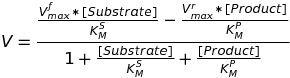

# Kinetic Laws

## Index

1. [README](../README.md)
2. [Usage](usage.md)
3. [References](references.md)

The simulations performed are basically applying a particular Kinetic Law to a reaction and devising a rate for the reaction.

There are 3 Kinetic Laws currently available to use in the application:

- Law of Mass Action
- Michaelis-Menten Kinetics
- Hill Kinetics

Other than this you can define your own Custom Rate

## _Law of Mass Action_

The law of mass action is the proposition that the rate of a chemical reaction is directly proportional to the product of the activities or concentrations of the reactants.

Examples:

Take the reaction:

```
Reactant ==> Product
```

Rate of the above reaction according to Mass Action would be:

```
[Reactant] * k
```

- [Reactant] is concentration of the Reactant
- k is a parameter that governs the reaction

Similarly for a reversible reaction:

```
Reactant <==> Product
```

Rate of the above reaction according to Mass Action would be:

```
[Reactant] * k1 - [Product] * k2
```

- [Reactant] is concentration of the Reactant
- [Product] is concentration of the Product
- k1 is the forward parameter
- k2 is the backward parameter

## _Michaelis-Menten Kinetics_

> Even though variations of this law exist for reactions with multiple reactants/products this application only implements this law for reactions with a single reactant and product.

Michaelis–Menten kinetics is one of the best-known models of enzyme kinetics. The model takes the form of an equation describing the rate of enzymatic reactions, by relating reaction rate to the concentration of a substrate.

Lets take the following reaction as a example:

```
Enzyme + Substrate ==> Intermediate (E + S) ==> Product + Enzyme
```

Its formula is given by:

```
V = (Vmax * [Substrate]) / (Km + [Substrate])
```

- [Substrate] is concentration of the Substrate
- V is the reaction rate
- Vmax represents the maximum rate achieved by the system
- Km is the Michaelis constant and is numerically equal to the substrate concentration at which the reaction rate is half of Vmax

For reversible reactions:

(Had to use an image, was to complex to write it in markdown 😋)



- [Substrate] is concentration of the Substrate
- [Product] is concentration of the Product
- V is the reaction rate
- V<sup>f</sup>max & V<sup>r</sup>max represent the maximum rate achieved by the system in the forward and reverse manner respectively.
- K<sup>S</sup>m and K<sup>P</sup>m is the Michaelis constant and is numerically equal to the substrate concentration at which the reaction rate is half of V<sup>f</sup>max and V<sup>r</sup>max respectively

## _Hill Kinetics_

> _Needs a description_

Formula:


- [S] is concentration of the Substrate
- V is the reaction rate
- Vmax represents the maximum rate achieved by the system
- K<sub>0.5</sub> is the Michaelis constant and is numerically equal to the substrate concentration at which the reaction rate is half of Vmax
- n is Hill's coefficient
