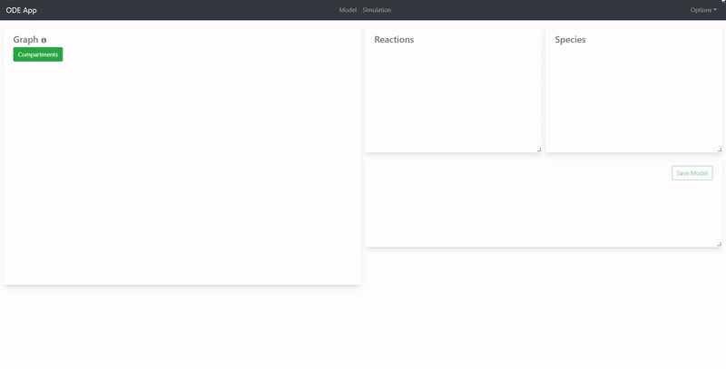
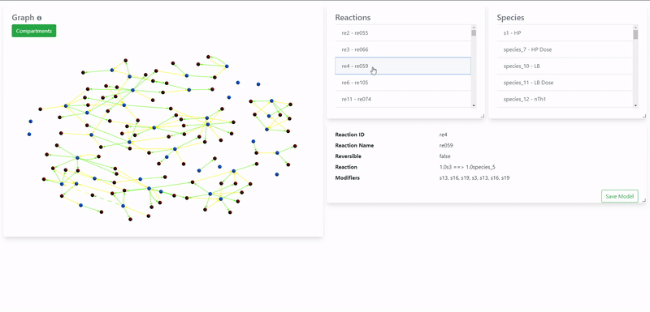
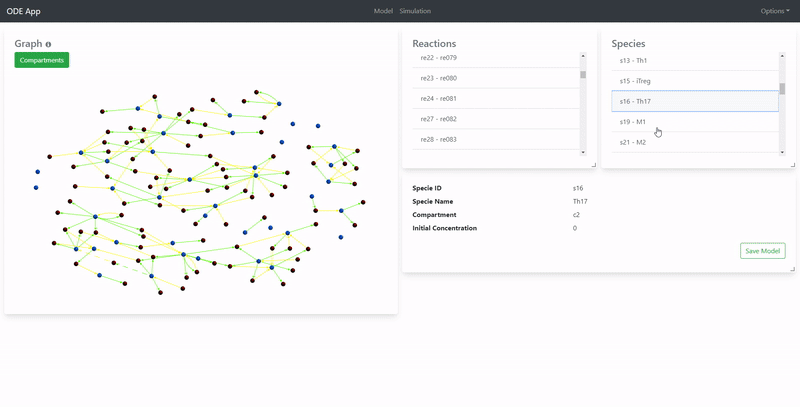
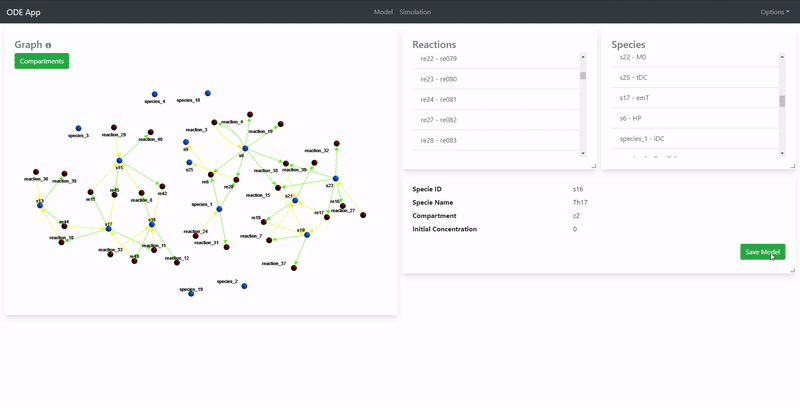
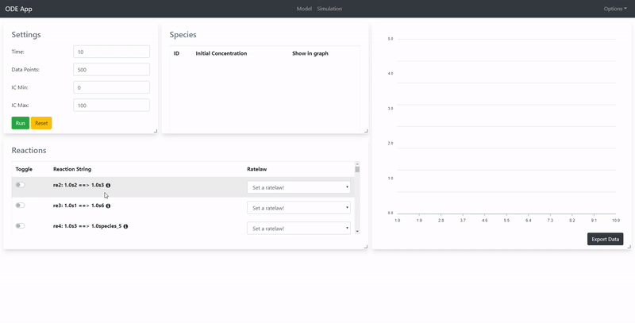
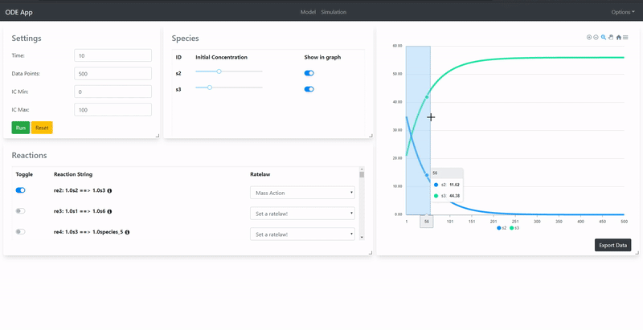
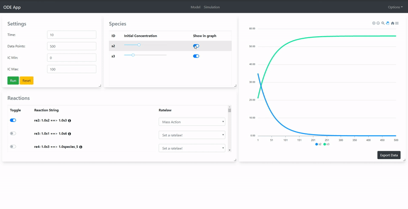
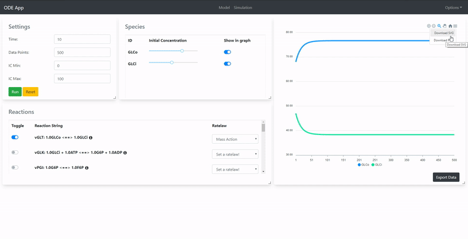

# Usage

Please visit http://134.209.96.118:5000/#/ to use the application.

## Index

1. [README](../README.md)
2. [Kinetic Laws](kinetic-laws.md)
3. [References](references.md)

## General functions

### Import a SBML model

> Only .sbml/.xml files supported

Navigate to the Navbar of the application > Find the 'Options' option > Click it to open a dropdown > Click on 'Import Model' > Selected a valid sbml/xml file > Click 'Open'.

### Use a saved model

Navigate to the Navbar of the application > Find the 'Options' option > Click it to open a dropdown > Click on 'Saved Models' > Click on the model you want to load.

## Model Tab

### View Reactions/Species of a model

Click on a reaction/specie to view it on the info panel.

### View the model visualized in a network graph

Drag and zoom on the graph panel. You can also switch the compartments to display compartment-wise reactions and species.

- Blue Circles -> Specie Nodes
- Red Circles -> Reaction Nodes
- Green line -> Reactant Edge
- Yellow line -> Product Edge
- Dotted line - Reversible reactions

### Save a model

Saving a model stores it in the database which will let you directly fetch it later without doing an import.

## Simulation Tab

### Perform a simple simulation

Follow the gif 😉. All simulations are governed by Kinetic Laws. Learn more about them [here.](kinetic-laws.md)

### View the result in the plot with additional features

Play around with the plot panel.

### Toggle a specie from the plot

### Download the plot

